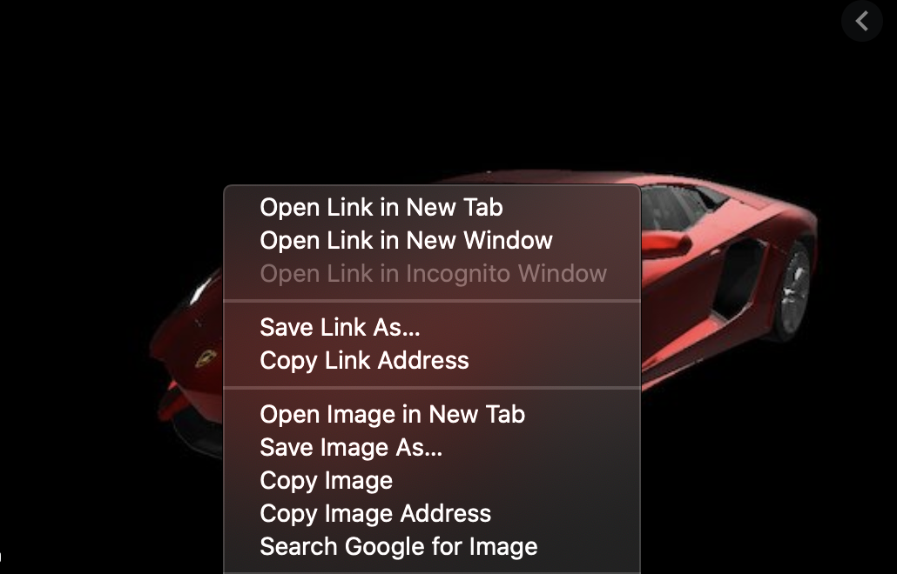

# CSC_ECE_517_Program_2 Team 1000

# **Submission**

Admin Credentials:

Email: market5172020@gmail.com

Password: password

Credit Cards is accessed in a link in the User's profile, which you can get to from the "Edit Profile" button in the top right header.

While creating an item, please use image URL. Our application doesn't support uploading images. You can get the URL by right clicking an image on web browser, and then clicking on **Copy Image Address** as shown in screenshot below:

Your submission in Expertiza should consist of the following-

* A link to your deployed application

* A link to your repository

    * Please also include in README file:

        * how to test various features (e.g., how to access certain pages, what details to enter in the form etc.)

        * How your program handles edge-case scenarios(e.g., what will happen if  admin deletes an item which is purchased by several people or it exists in their cart? )
